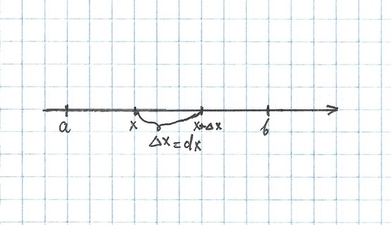
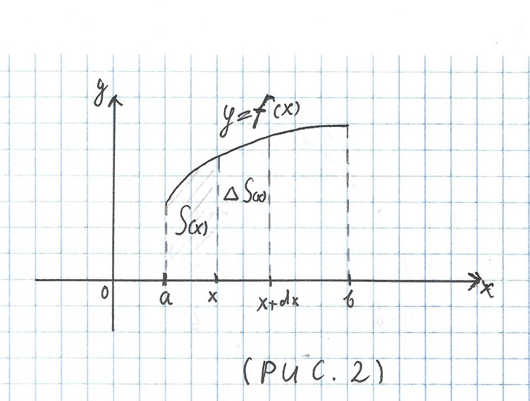
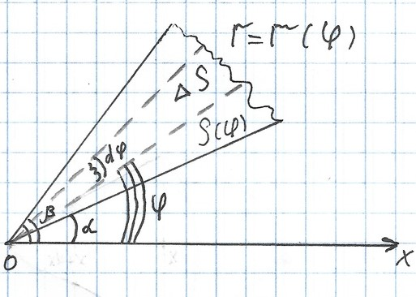
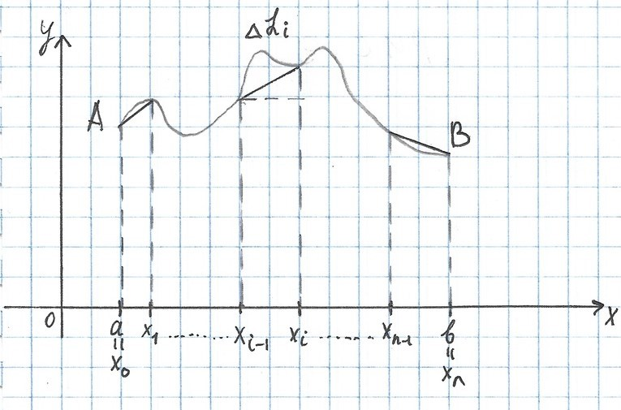
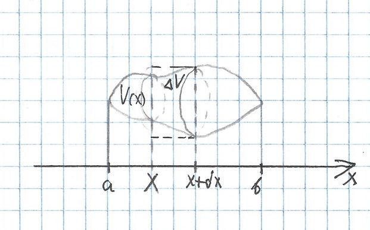
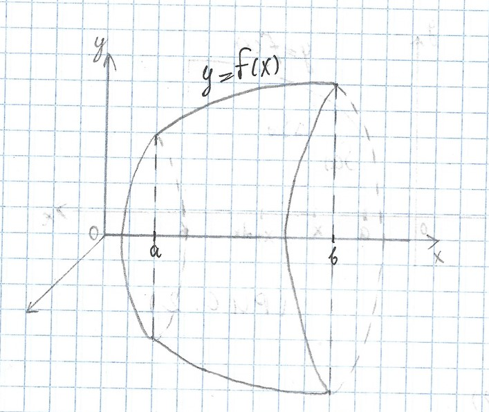
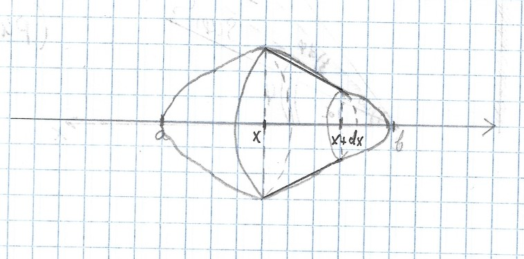

# Lecture 1

# Приложения интеграла

## Задача I(Понятие определенного интеграла)

$A$ - величина, $[a, b]$ - связанный с ней отрезок

### 1. Метод интегральных сумм

_рис 1_

{ width=75% }

Рассмотрим $[a,b], a= x_0, x_1, ..., x_i, ..., x_{n-1}, x_n = b$

Рассмотрим $[x_{i-1}, x_i] \implies$ Рассмотрим $A_i = f(\psi_i) \bigtriangleup x_i, \psi_i \in [x_{i-1}, x_i]$

$$A \approx \sum_{i = 1}^n A_i$$

$$A = \lim_{n \rightarrow \infty, \bigtriangleup x_i \rightarrow 0} {\sum_{i = 1}^n A_i} = \int_a^b f(x)dx$$

### 2. Метод дифференциала

Рассмотрим $A = A(x), x \in [a,b] \stackrel{\bigtriangleup x}{\implies} \bigtriangleup A \implies dA = f(x)dx$

$$A = \int_a^b f(x)dx $$

## Примеры 
1. ### Вычисление площади плоской фигуры в декартовых прямоугольных координатах

    1. __1.1__
        $$y = f(x), x > a, x < b$$

        $$f(x) \geq 0, x \in [a, b] $$

        $$S(a) = 0, S(b) = S_{тр}$$

        $$dS = f(x)dx$$

        $$S_{тр} = \int_a^b f(x)dx $$

        ---
        $$\large \bold{\bigtriangleup S \approx dS, \bigtriangleup x \rightarrow 0}$$
        ---

        _рис 2_

        { width=60% }

        $$S_f  = \int_a^b [f_2(x) - f_1(x)]dx$$
    2. __1.2 Параметрические функции__
        $$\begin{cases}
            x = x(t), t \in [\alpha, \beta] \\
            y = y(t)
        \end{cases} $$

        $$S_{тр} = \int_{\alpha}^{\beta} y(t) * x'(t) dt$$
    3. __1.3 Функция в полярных координатах__

        _рис 3_

        { width=60% }

        $$dS = \frac{1}{2} r^2(\varphi) d\varphi $$

        $$S = \frac{1}{2} \int_{\alpha}^{\beta} r^2(\varphi) d\varphi $$

2. ### Вычисление длин дуг (кривых)
    1. __2.1__

        _рис 4_

        { width=75% }

        $$a=x_0, b = x_n $$
        $$\delta = max \bigtriangleup x_i \rightarrow 0 $$
        $$l = \lim_{n \rightarrow \infty} L_n $$
        $$L_i, \bigtriangleup L_i = \sqrt{(\bigtriangleup x_i)^2 + (\bigtriangleup y_i) ^2} = \sqrt{(\bigtriangleup x_i)^2 + (f(x_i) - f(x_{i-1}))^2} =$$

        $$\sqrt{(\bigtriangleup x_i)^2 + [f'(\psi_i)]^2(\bigtriangleup x_i)^2}$$
        $$L_n = \sum_{i = 1}^n \sqrt{1 + (f')^2(\psi_i)}\bigtriangleup x_i $$
        $$l \stackrel{def}{=} \lim_{n \rightarrow \infty} L_n = \lim_{n \rightarrow \infty, \delta \rightarrow 0}  \sum_{i = 1}^n \sqrt{1 + (f')^2(\psi_i)}\bigtriangleup x_i  $$

        ---
        
        $$l = \int_a^b \sqrt{1 + (y')^2}dx $$

        ---

        $$ dl = l'(x)dx$$
        $$ l'(x) = \lim_{\bigtriangleup x \rightarrow 0} \cfrac{\bigtriangleup l}   {\bigtriangleup x} = \lim_{\bigtriangleup x \rightarrow 0} \cfrac{\sqrt{   (\bigtriangleup x)^2 + (\bigtriangleup y)^2}}{\bigtriangleup x}$$

        $$= \lim_    {\bigtriangleup x \rightarrow 0}
        \sqrt{1 + (\cfrac{(\bigtriangleup y)^2}{\bigtriangleup x})} = \sqrt{1 + (y')    ^2} $$
        $$dl = \sqrt{1 + (y')^2}dx $$
        $$dl = \sqrt{(dx)^2 + (dy)^2} $$
        $$y' = \cfrac{dy}{dx} $$

    2. __2.2 Параметрическая функция__
        $$\begin{cases}
            x = x(t), t \in [\alpha, \beta] \\
            y = y(t)
        \end{cases} $$
        $$l = \int_{\alpha}^{\beta} \sqrt{(x_t')^2 + (y_t')^2} $$
    3. __2.3__ Функция в полярных координатах
        $$] r = r(\phi), \alpha \leq \phi \leq \beta $$
        $$\begin{cases}
            x = r*cos(\phi) \\
            y = r*sin(\phi)
        \end{cases} $$
        Рассмотрим
        $$\begin{cases} 
            x = r(\phi) cos \phi\\ 
            y = r(\phi) sin \phi 
        \end{cases}$$
        $$(x_{\phi}')^2 + (y_{\phi}')^2 = (r'(\phi)cos \phi - r(\phi) sin \phi)^2 +
        (r'(\phi)sin \phi + r(\phi) cos \phi)^2 = r'(\phi)^2 r^2(\phi)  $$

        ---

         $$\large \bold l = \int_{\alpha}^{\beta} \sqrt{r'(\phi)^2 + r^2{\phi}} d\phi$$

        ---
3. ### Вычисление объемов тел по  известным площадям поперечных сечений
   1. __3.1__

        _рис 5_

        { width=60% }

        Обозначим площадь сечения $S(x)$

        Заменяем на цилиндр с высотой dx

        $$dV(x) = S(x)dx$$

        $$V = \int_a^b S(x)dx $$
    1. __3.2__ __Вычисление объма тела вращения__

        _рис 6_

        { width=50% }

        $$] y = f(x) $$
        
        $$S(x) = \pi f(x)^2 $$
        
        $$V_x = \pi \int_a^b y^2dx $$
        $V_x$ - Тело вращаем относительно оси $O_x$
        $$V_y = \pi \int_a^b x^2(y)dy $$

4. ### Площадь поверхности тел

    _рис 7_

    { width=60% }

    Рассмотрим $S(x), \bigtriangleup S(x)$

    $] T$ - тело вращения вокруг $O_x$

    $$dS = \pi (y + y + dy)dl \approx 2 \pi y dl + \pi*dydl = 2\pi ydl$$

    $$S_{пов} = 2\pi \int_a^b y(x)\sqrt{1 + y'(x)^2}dx $$

### Пример для шара

$$V = 2\pi \int_0^r (r^2 -x^2)dx = 2\pi(xr^2 - \cfrac{x^3}{3}) $$
    

